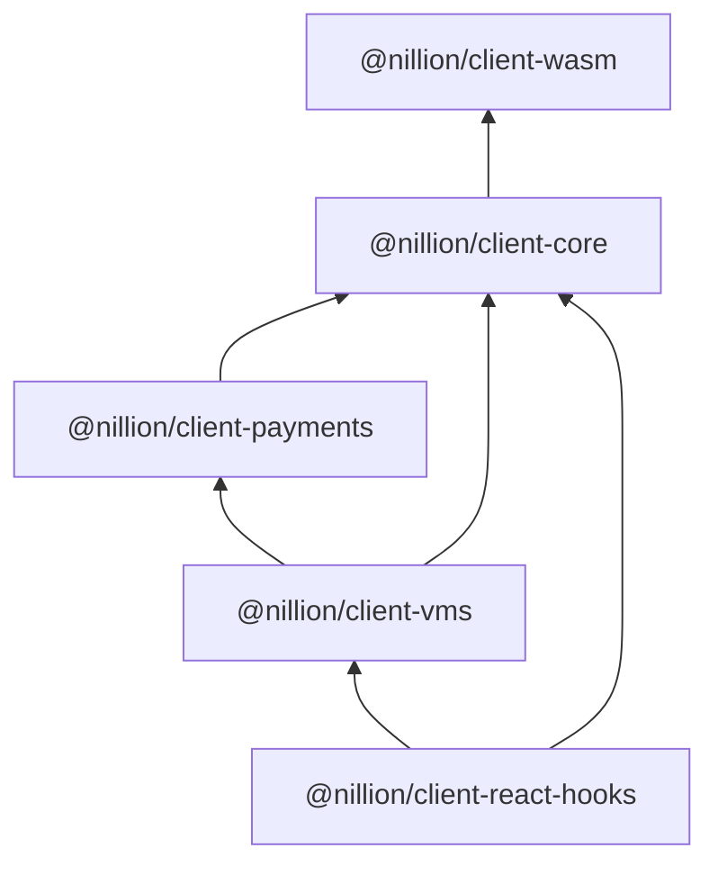

<!-- @formatter:off -->
# &middot; [Nillion](https://nillion.com) &middot;

[](https://github.com/facebook/react/blob/main/LICENSE) [](https://nillion.pub/client-ts) [](https://github.com/NillionNetwork/client-ts/issues) [](https://www.npmjs.com/package/@nillion/client-wasm) [](https://www.npmjs.com/package/@nillion/client-core)  [](https://www.npmjs.com/package/@nillion/client-payments) [](https://www.npmjs.com/package/@nillion/client-vms) [](https://www.npmjs.com/package/@nillion/client-react-hooks)

TypeScript client libraries for interacting with a Nillion cluster.

## Table of Contents

- [Prerequisites](#prerequisites)
- [Quick Start](#quick-start)
- [Packages and Package Hierarchy](#packages-and-package-hierarchy)
- [Client Creation and Configuration](#client-creation-and-configuration)
- [React Hooks](#react-hooks)
- [Logging](#logging)
- [Nada Types](#nada-types)
- [Getting Help](#getting-help)

## Prerequisites

- Only browser environments are supported
- All packages are ES modules
- Run a local development cluster with [nilup](https://docs.nillion.com/nilup)
- HTTP headers are needed in order for the browser to load the wasm bundle:
   - `Cross-Origin-Embedder-Policy: require-corp`
   - `Cross-Origin-Opener-Policy: same-origin`
- The nilchain spawned with [nillion-devnet](https://docs.nillion.com/nillion-devnet) does not support CORS, therefore the recommended workaround is proxy requests to nilchain for local development

## Quick Start

Complete examples are available at [examples/react](https://github.com/NillionNetwork/client-ts/tree/main/examples/react) or [examples/nextjs](https://github.com/NillionNetwork/client-ts/tree/main/examples/nextjs).


1. Ensure you are running `nillion-devnet` in another terminal window

2. Add Nillion dependencies to a your React / nextjs project

  ```shell
  npm i -P @nillion/client-react-hooks@latest
  ```

3. You have to add certain HTTP headers: adjust your `webpack` / `next.config.mjs` configration. Please refer to the [React webpack example](https://github.com/NillionNetwork/client-ts/blob/main/examples/react/webpack.config.mjs) or the [nextjs example](https://github.com/NillionNetwork/client-ts/blob/main/examples/nextjs/next.config.mjs)

4. Create a client to interact with the local devnet:

Note: If `network: NamedNetwork.enum.Devnet` is provided, then we don't need to specify bootnodes, cluster or chain since these values are copied from the partial configuration provided.

  ```ts
  const client = NillionClient.create({
    network: NamedNetwork.enum.Devnet,
    overrides: async () => {
      // this is the account's private key when running `nillion-devnet` with default seed
      const signer = await createSignerFromKey("9a975f567428d054f2bf3092812e6c42f901ce07d9711bc77ee2cd81101f42c5");
      return {
        endpoint: "http://localhost:3000/nilchain",
        signer,
        userSeed: "nillion-devnet",
      };
    }
  })
  ```

5. Near the root of your component hierarchy, add `NillionClientProvider`:

  ```tsx
  export function App() {
    return (
      <NillionClientProvider client={client}>
        <Home />
      </NillionClientProvider>
    );
  }
  ```

6. Expose the client to your component:

  ```tsx
    export default function Home() {
    const [id, setId] = useState("");
    const storeValue = useStoreValue();

    if (storeValue.data && !id) {
      setId(storeValue.data);
    }

    const handleStoreClick = () => {
      storeValue.mutate({
        values: {
          foo: 42,
        },
        ttl: 1,
      });
    };

    return (
      <div>
        <h2>Hello 👋</h2>
        <p>Data: {JSON.stringify(data)}</p>
        <button onClick={handleStoreClick} disabled={storeValue.isPending}>Store</button>
        <ul>
          <li>Status: {storeValue.status}</li>
          {id && <li>Id: {id}</li>}
        </ul>
      </div>
    );
  }
  ```

7. Next, run your app and click "Store"

After a few seconds you should see `Status: succcess` and `Id: <uuid>` rendered. Congratulations, now you can interact with the client. 🎉

8. (Optional) Once you want to switch to production ready apps, you can use the `Photon` testnet by switching  `network` to `Photon`, then, you are only required to provide a `user-seed`

[`Photon` configurations are available as well](https://github.com/NillionNetwork/client-ts/blob/main/packages/client-core/src/configs.ts).


## Packages and Package Hierarchy

This guide focuses on `@nillion/client-vms` and `@nillion/client-react-hooks` -- other libraries are not intended for direct consumption by the end user.

1. `@nillion/client-wasm` a wasm bundle and web worker for communicating with the cluster
2. `@nillion/client-core` manages wasm initialization and provides a wrapper for wasm functionality
3. `@nillion/client-payments` the nilchain gRPC client
4. `@nillion/client-vms` combines functionality from `client-core` and `client-payments` into a single user-facing API
5. `@nillion/client-react-hooks` based on [ReactQuery](https://github.com/TanStack/query): this package provides convenience react hooks for building frontend apps



## Client Creation and Configuration

There are three phases to preparing a client for use:

1. Wasm bundle loading and initialization
2. Client configuration
3. Client connection

When a `NillionClient` is created `connect(): Promise<boolean>` must be called before the client is used. This method will take care of steps 1 and 2 above and ensure the wasm bundle is correctly loaded and initialized.

To create a nillion client:

```ts
const config: NillionClientConfig = { ... }
const client = NillionClient(config)
```

A minimal config for using a `nillion-devnet`:

```ts
const config = {
  // if omitted defaults to Photon testnet,
  network: NamedNetwork.enum.Devnet,
  overrides: async () => {
    const signer = await createSignerFromKey("payment-account-private-key")
    return {
      signer,
      // webpack devserver address proxied to nilchain
      endpoint: "http://localhost:8080/nilchain",
      userSeed: "unique-user-seed",
    }
  }
}
```

Note: Beware of key precedence (highest to lowest):

1. The overrides function
2. Keys defined in the `NillionClientConfig` object passed to `NillionClient.create({ ... })`
3. Keys from a `NamedNetwork` configuration

## React Hooks

[Quick Start](#quick-start) provides the details to get started. This section builds on it and provides more details on the React hooks exported from  `@nillion/client-react-hooks`.

`NillionClientProvider` provides a `NillionClient` instance to child components through the `useNillion()` hook. It takes care of asynchronously connecting the client to the network and creating a `ReactQuery` client and provider. If an existing `ReactQuery` provider is detected it will be reused.

The following hooks are [React Query](https://tanstack.com/query/latest/docs/framework/react/guides/queries)-based:

- `useFetchValue()`
- `useFetchPermissions()`
- `useFetchProgramOutput()`

The following hooks are [React Mutation](https://tanstack.com/query/latest/docs/framework/react/guides/mutations)-based:

- `useStoreValue()`
- `useSetPermissions()`
- `useUpdateValue()`
- `useStoreProgram()`
- `useRunProgram()`

Hooks accept an `options` object and a React `query` or `mutation` `overrides` an object. For example:

```ts
const fetch = useFetchValue(
// options object
{
  id,
  name: "foo",
  type: NadaValueType.enum.SecretString,
},
// react query overrides
{
  refetch: false
});
```

## Logging

Logging is on by default for all networks except `Photon`. To enable it for `Photon`:

- Enable the `nillion:*` namespace: `const config: NillionClientConfig = { overrides: () => ({ logging : true }) }` or invoke the global helper: `window.__NILLION.enableLogging()`; or
- If you want granular control, include `nillion:*` in your localStorage debug key: `localStorage.debug = "foo:*,nillion:*"`.

Disable logging with `window.__NILLION.disableLogging()` or remove `nillion:*` from `localStorage.debug`. You may need to reload the window for changes to take effect.

Wasm logging is also an option, but not enabled by default. To enable it:

- Start a websocket server, eg, `websocat -s 11100`
- After the client is initialized run `window__NILLION.enableWasmLogging()`

## Nada Types

The `@nillion/client-react-hooks` and `@nillion/client-vms` packages provide convenience functions for storing nada types.

```ts
type NadaPrimitiveValue = Uint8Array | string | bigint | number
type StoreValueArgs = {
  data: NadaPrimitiveValue,
  secret: boolean
}
type values = Record<NamedValue | string, NadaPrimitiveValue | StoreValueArgs>

client.store({
  values: {
    foo: 42
  },
  ttl: 1
})
```

The `values` object is converted into a Nada type as follows:

| Primitive    | Nada Type               |
|--------------|-------------------------|
| `number`     | `SecretInteger`         |
| `bigint`     | `SecretIntegerUnsigned` |
| `string`     | `SecretBlob`            |
| `Uint8Array` | `SecretBlob`            |

To create a public value provide `StoreValueArgs`:

```ts
const values = {
  foo: {
    data: 42,
    secret: false
  }
}
```

## Getting Help

Ask for help in the [Nillion Github Discussions](https://github.com/orgs/NillionNetwork/discussions), or if you've found a bug with `client-ts`, [file an issue](https://github.com/NillionNetwork/client-ts/issues).
