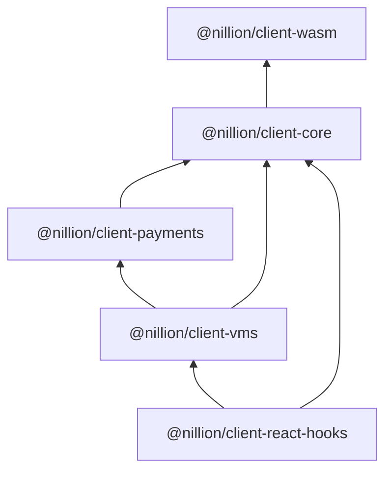

<!-- @formatter:off -->
# Nillion

Typescript libraries for interacting with a nillion cluster.

## Table of Contents

- [Prerequisites](#prerequisites)
- [Quick start](#quick-start)
- [Storing and retrieving secrets](#storing-and-retrieving-secrets)
- [Client configuration](#configure)
- [Connect](#configure)
- [Logging](#logging)
- [Packages hierarchy](#package-hierarchy)

## Prerequisites

- Be running in a browser environment.
- Your server must supply the following HTTP headers for the wasm bundle:
   - `Cross-Origin-Embedder-Policy: require-corp`
   - `Cross-Origin-Opener-Policy: same-origin`

## Quick start

1. Add nillion dependencies: `npm i -D @nillion/client-core @nillion/client-vms @nillion/client-react-hooks`

2. Create a client:

```ts
// by default this connects to the Photon test network and uses keplr for tx signing
const client = NillionClient.create({
  userSeed: "unique-user-seed",
  nodeSeed: "unique-node-seed",
  
  overrides: async () => {
    return {
      endpoint: "https://testnet-nillion-rpc.lavenderfive.com",
    };
  }
})
```

3. Wrap your components with `NillionClientProvider`:

```tsx
export function App() {
  return (
    <NillionClientProvider client={client}>
      <Home />
    </NillionClientProvider>
  );
}
```

4. Expose the client to your component:

```tsx
import * as React from "react"
import { useNillion } from "@nillion/client-react-hooks" 
import { ClusterDescriptor } from "@nillion/client-core";

export const Home = () => {
  const nillion = useNillion()
  const [descriptor, setDescriptor] = React.useState<ClusterDescriptor>()
  const [error, setError] = React.useState<Error | undefined>()
  
  const run = async () => {
    const response = await nillion.client.fetchClusterInfo()
    if(response.ok) {
      setDescriptor(response.ok)
    } else {
      setError(response.err)
    }
  }
  
  React.useEffect(() => {
    void run()
  }, [nillion.ready])
  
  if(error) {
    return (
        <div>
          <h1>Error</h1>
          <p>{JSON.stringify(error)}</p>
        </div>
    );
  }
  
  return (
    <div>
      <h1>Cluster descriptor</h1>
      <p>{descriptor ? JSON.stringify(descriptor) : "Loading ..."}</p>
    </div>
  );
}
```

5. If you see the cluster descriptor `b13880d3-dde8-4a75-a171-8a1a9d985e6c` rendered then you're client is successfully talking to the cluster and you can proceed onto following sections for storing and retrieving secrets.

## Storing and retrieving secrets

### Storing secrets

```ts
// store a signed secret integer with the name "foo"
const intSecretStoreIdResponse = await client.store({ foo: -42 })
if(intSecretStoreIdResponse.ok) {
  const storeId = result.ok
}

// store an unsigned secret integer
const uintSecretStoreIdResponse = await client.store({ foo: 100n })

// store a signed public integer
const intPublicStoreIdResponse = await client.store({ foo: { data: -42, secret: false }})

// store an unsigned public integer
const intPublicStoreIdResponse = await client.store({ foo: { data: 77n, secret: false }})

// store a secret blob
const blob = new TextEncoder().encode("hello!")
const blogStoreIdResponse = await client.store({ foo: blob })
```

### Fetching values

```ts
const name = "foo"
const type = NadaValueType.IntegerSecretUnsigned
const intSecretFetchValueResponse = await client.fetch({ id, name, type })
if(intSecretFetchValueResponse.ok) {
  const theAnswer: number = intSecretFetchValueResponse.ok
}
```

## Configure

The client's config option precedence is:

1. Keys returned from the overrides function.
2. Valid keys specified in the config object
3. Keys provided by Config exported from `@nillion/client`

The expected config shape is:

```ts
interface NillionClientConfig {
  network: "Photon" | "Nucleus" | "Devnet" | "TestFixture" | "Custom" | undefined // defaults to "Photon"
  userSeed: UserSeed | string | undefined
  nodeSeed: NodeSeed | string | undefined
  overrides: () => Promise<Partial<NillionClientConfigComplete>> | undefined
}

const config = { ... }
// The client is created synchronously to avoid top-level await issues
const client = NillionClient.create(config)
```

## Connect

`NillionClientProvider` and `useNillion()` take care of connecting and report client readiness as:

```ts
const nillion = useNillion()
nillion.ready // true when successfully connected else false
nillion.client.ready // same result as above
```

If you are not using `NillionClientProvider` to manage the client for you, then you will need call connect before you first use the client: 

```ts
declare const client: NillionClient
await client.connect()
```

## Logging

Once the client is connected you can enable logging via the dev console with:

```ts
window.__NILLION.enableLogging() // sets localStore.debug = "nillion:*"
```


## Package hierarchy


