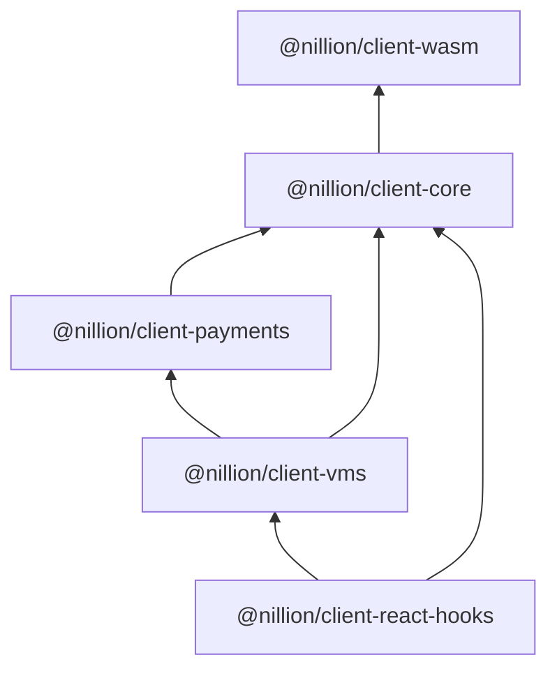

<!-- @formatter:off -->
# Nillion

Typescript libraries for interacting with a nillion cluster.

## Table of Contents

- [Prerequisites](#prerequisites)
- [Quick start](#quick-start)
- [Packages and package hierarchy](#packages-and-package-hierarchy)
- [Client configuration](#client-creation-and-configuration)
- [React hooks](#react-hooks)
- [Logging](#logging)
- [Nada types](#nada-types)

## Prerequisites

- Only browser environments are supported.
- All packages are ES modules.
- Run a local development cluster with [nilup](https://docs.nillion.com/nilup).
- HTTP headers are needed in order for the browser to load the wasm bundle:
   - `Cross-Origin-Embedder-Policy: require-corp`
   - `Cross-Origin-Opener-Policy: same-origin`
- The nilchain spawned with `nillion-devnet` does not support CORS. The recommended workaround is proxy requests to nilchain for local development. 

## Quick start

1. Add nillion dependencies to a basic React + webpack project. You will need to configure the webpack dev server to ensure the correct HTTP headers are set and a proxy is configured.

```shell 
npm i -D @nillion/client-core@next @nillion/client-vms@next @nillion/client-react-hooks@next`
```

2. Create a client:

```ts
import { NamedNetwork } from "@nillion/client-core"; 
import { createSignerFromKey } from "@nillion/client-payments"; 
import { NillionClient } from "@nillion/client-vms"; 

const client = NillionClient.create({
  network: NamedNetwork.enum.Devnet,
  
  overrides: async () => {
    // this is the account's private key when running `nillion-devnet` with default seed
    const signer = await createSignerFromKey("9a975f567428d054f2bf3092812e6c42f901ce07d9711bc77ee2cd81101f42c5");
    return {
      endpoint: "https://testnet-nillion-rpc.lavenderfive.com",
      userSeed: "unique-user-seed",
      nodeSeed: "unique-node-seed",
      signer,
    };
  }
})
```

3. Wrap your components with `NillionClientProvider`:

```tsx
import { NillionClientProvider } from "@nillion/client-react-hooks"; 

export function App() {
  return (
    <NillionClientProvider client={client}>
      <Home />
    </NillionClientProvider>
  );
}
```

4. Expose the client to your component:

```tsx
import * as React from "react";
import { useState } from "react";
import { useStoreValue } from "@nillion/client-react-hooks";

export default function Home() {
  const [id, setId] = useState("");
  const storeValue = useStoreValue();

  if (storeValue.data && !id) {
    setId(storeValue.data);
  }

  const handleStoreClick = () => {
    storeValue.mutate({
      values: {
        foo: 42,
      },
      ttl: 1,
    });
  };

  return (
    <div>
      <h2>Hello 👋</h2>
      <p>Data: {JSON.stringify(data)}</p>
      <button onClick={handleStoreClick} disabled={storeValue.isPending}>Store</button>
      <ul>
        <li>Status: {storeValue.status}</li>
        {id && <li>Id: {id}</li>}
      </ul>
    </div>
  );
}

```

5. Next run your app and click "Store". After a few seconds you should see `Status: succcess` and `Id: <uuid>` rendered. Complete examples are available at [examples/react](./examples/react) or [examples/nextjs](./examples/nextjs).

## Packages and package hierarchy

This guide focuses on `@nillion/client-vms` and `@nillion/client-react-hooks` (the other libraries are not intended for direct consumption).

1. `@nillion/client-wasm` a wasm bundle and web worker for communicating with the cluster.
2. `@nillion/client-core` manages wasm initialization and provides a wrapper for wasm functionality.  
3. `@nillion/client-payments` the nilchain gRPC client.
4. `@nillion/client-vms` combines functionality from `client-core` and `client-payments` into a single user-facing API.
5. `@nillion/client-react-hooks` based on [ReactQuery](https://github.com/TanStack/query), this package provides convenience react hooks for building frontend apps.



## Client creation and configuration

There are three phases to preparing a client for use:

1. Wasm bundle loading and initialization.
2. Client configuration.
3. Client connection.

When a `NillionClient` is created `connect(): Promise<boolean>` must be called before the client is used. This method will take care of steps 1 and 2 above and ensure the wasm bundle is correctly loaded and initialised.

To create a nillion client 

```ts
import { NillionClient,NillionClientConfig } from "@nillion/client-vms";

const config: NillionClientConfig = { ... }
const client = NillionClient(config)
```

A minimal config for using a `nillion-devnet`:

```ts
import { NamedNetwork } from "@nillion/client-core/src"; 
import { createSignerFromKey } from "@nillion/client-payments/src";

const config = {
  // if omitted defaults to Photon testnet,
  network: NamedNetwork.enum.Devnet,
  overrides: async () => {
    const signer = await createSignerFromKey("payment-account-private-key")
    return {
      signer,
      // webpack devserver adddres proxied to nilchain
      endpoint: "http://localhost:8080/nilchain", 
      userSeed: "nillion-devnet",
      nodeSeed: "nillion-devnet",
    }
  }
}
```

Config key precedence (highest to lowest):

1. The overrides function.
2. Keys defined in the `NillionClientConfig` object passed to `NillionClient.create({ ... })`.
3. Keys from a NamedNetwork Config.

## React hooks

[Quick start](#quick-start) provides the details to get started. This section builds on it and provides more details on the React hooks exported from  `@nillion/client-react-hooks`.

`NillionClientProvider` provides a `NillionClient` instance to child components through the `useNillion()` hook. It takes care of asynchronously connecting the client to the network and creating a `ReactQuery` client and provider. If an existing `ReactQuery` provider is detected it will be reused.

The following hooks are [React Query](https://tanstack.com/query/latest/docs/framework/react/guides/queries) based:

- `useFetchValue()`
- `useFetchPermissions()`
- `useFetchProgramOutput()`

The following hooks are [React Mutation](https://tanstack.com/query/latest/docs/framework/react/guides/mutations) based:

- `useStoreValue()`
- `useSetPermissions()`
- `useUpdateValue()`
- `useStoreProgram()`
- `useRunProgram()`

Hooks accept an `options` object and a React `query` or `mutation` `overrides` object. For example:

```ts
const fetch = useFetchValue(
// options object
{
  id,
  name: "foo",
  type: NadaValueType.enum.SecretString,
},
// react query overrides
{ 
  refetch: false  
});
```

## Logging

Once the client is initialized you can enable logging in the dev console with either:

```ts
window.__NILLION.enableLogging()

// or set the debug value in local storage if your client hasn't yet been initialised. 
localStorage.debug = "nillion:*"
```

To enable wasm logging:

- Start a websocket server, eg, `websocat -s 11100`.
- In the dev console, and after client initialization, run `window__NILLION.enableWasmLogging()`

## Nada types

The `@nillion/client-react-hooks` and `@nillion/client-vms` packages provide convenience functions for storing nada types.

```ts
type NadaPrimitiveValue = Uint8Array | string | bigint | number
type StoreValueArgs = {
  data: NadaPrimitiveValue,
  secret: boolean
}
type values = Record<NamedValue | string, NadaPrimitiveValue | StoreValueArgs>

client.store({
  values: {
    foo: 42
  },
  ttl: 1
})
```

The `values` object is converted into Nada types as follows:

| Primitive    | Nada Type               |
|--------------|-------------------------|
| `number`     | `SecretInteger`         |
| `bigint`     | `SecretIntegerUnsigned` |
| `string`     | `SecretBlob`            |
| `Uint8Array` | `SecretBlob`            |

To create a public value provide `StoreValueArgs`:

```ts
const values = {
  foo: {
    data: 42,
    secret: false
  }
}
```
