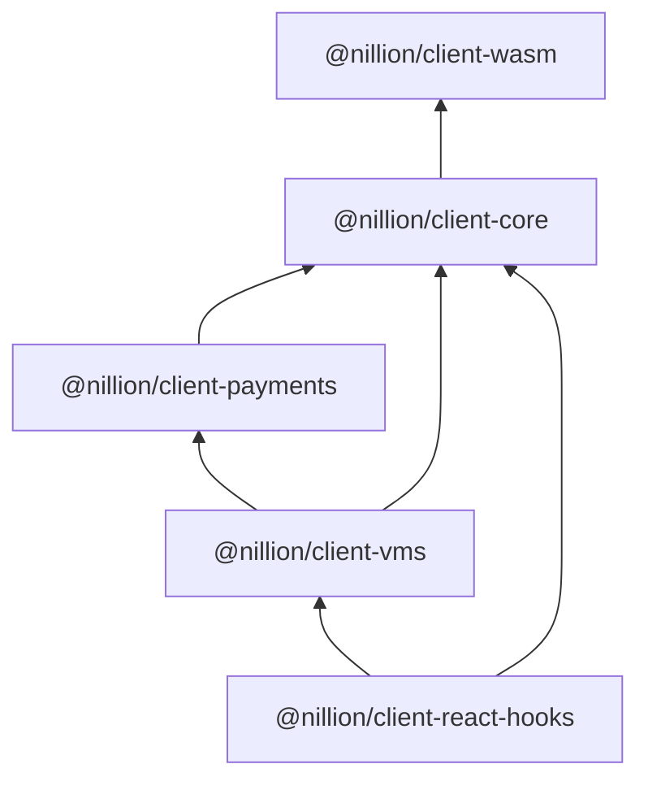

<!-- @formatter:off -->
# &middot; [Nillion](https://nillion.com) &middot;

[](https://github.com/facebook/react/blob/main/LICENSE) [](https://nillion.pub/client-ts) [](https://github.com/NillionNetwork/client-ts/issues) [](https://www.npmjs.com/package/@nillion/client-wasm) [](https://www.npmjs.com/package/@nillion/client-core)  [](https://www.npmjs.com/package/@nillion/client-payments) [](https://www.npmjs.com/package/@nillion/client-vms) [](https://www.npmjs.com/package/@nillion/client-react-hooks)

TypeScript client libraries for interacting with a Nillion cluster.

## Table of Contents

- [Prerequisites](#prerequisites)
- [Quick Start](#quick-start)
- [Packages and Package Hierarchy](#packages-and-package-hierarchy)
- [Client Creation and Configuration](#client-creation-and-configuration)
- [React Hooks](#react-hooks)
- [Logging](#logging)
- [Nada Types](#nada-types)
- [Getting Help](#getting-help)

## Prerequisites

- Only browser environments are supported
- All packages are ES modules
- Install a local development cluster with [nilup](https://docs.nillion.com/nilup) and run it with `nillion`
- HTTP headers are needed in order for the browser to load the wasm bundle:
   - `Cross-Origin-Embedder-Policy: require-corp`
   - `Cross-Origin-Opener-Policy: same-origin`
- The nilchain spawned with [nillion-devnet](https://docs.nillion.com/nillion-devnet) does not support CORS, therefore the recommended workaround is proxy requests to nilchain for local development

## Quick Start

To get started, checkout the full nextjs + react + nillion example is at [examples/nextjs](https://github.com/NillionNetwork/client-ts/tree/main/examples/nextjs).

1. `cd examples/nextjs`
2. In one terminal start a local devnet with `$ nillion-devnet`
3. In another terminal start the nextjs app `$ npm run dev`
4. Browse to `http://localhost:4321`

Note: The keplr browser extension is recommended for production apps. 

## Installation

```shell
npm i -P @nillion/client-react-hooks@^0.1.0 @nillion/client-payments@^0.1.0 @nillion/client-vms@^0.1.0 @nillion/client-core@^0.1.0
```

## React

1. Wrap your app with the `NillionProvider`:

  ```tsx
  import { type FC } from "react";
  
  import { NillionProvider } from "@nillion/client-react-hooks";
  
  export const App: FC = () => {
    return (
      <NillionProvider network="devnet">
        {/*  your components */}
      </NillionProvider>
    );
  };
  ```

2. Before using nillion, authenticate the client as show in [Login.tsx](examples/nextjs/app/components/login.tsx)
3. Once authenticated the following hooks can be used:

- `useNillion()`
- `useNilStoreValue()`
- `useNilStoreValues()`
- `useNilUpdateValue()`
- `useNilDeleteValue()`
- `useNilFetchValue()`
- `useNilStoreProgram()`
- `useNilCompute()`
- `useNilComputeOutput()`

## Logging

Logging is on by default for all networks except `Photon`. To enable it for `Photon`:

- Enable the `nillion:*` namespace: `const config: NillionClientConfig = { overrides: () => ({ logging : true }) }` or invoke the global helper: `window.__NILLION.enableLogging()`; or
- If you want granular control, include `nillion:*` in your localStorage debug key: `localStorage.debug = "foo:*,nillion:*"`.

Disable logging with `window.__NILLION.disableLogging()` or remove `nillion:*` from `localStorage.debug`. You may need to reload the window for changes to take effect.

Wasm logging is also an option, but not enabled by default. To enable it:

- Start a websocket server, eg, `websocat -s 11100`
- After the client is initialized run `window__NILLION.enableWasmLogging()`


## Packages and Package Hierarchy

This guide focuses on `@nillion/client-vms` and `@nillion/client-react-hooks` -- other libraries are not intended for direct consumption by the end user.

1. `@nillion/client-wasm` a wasm bundle and web worker for communicating with the cluster
2. `@nillion/client-core` manages wasm initialization and provides a wrapper for wasm functionality
3. `@nillion/client-payments` the nilchain gRPC client
4. `@nillion/client-vms` combines functionality from `client-core` and `client-payments` into a single user-facing API
5. `@nillion/client-react-hooks` based on [ReactQuery](https://github.com/TanStack/query): this package provides convenience react hooks for building frontend apps



## Getting Help

Ask for help in the [Nillion Github Discussions](https://github.com/orgs/NillionNetwork/discussions), or if you've found a bug with `client-ts`, [file an issue](https://github.com/NillionNetwork/client-ts/issues).
