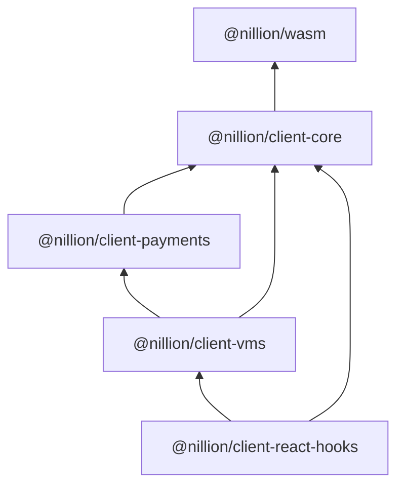

# nillion-ts

An exploration into how we can deliver a better DX to the TS/JS ecosystem.

## Notes

1. `<React.StrictMode />` in particular is tricky ... result in console errors where the wasm bundle is loaded /
   unloaded in
   quick succession. For example:

   ```
   index.js:23 Uncaught Error: recursive use of an object detected which would lead to unsafe aliasing in rust
       at e.wbg.__wbindgen_throw (index.js:23:47590)
       at 3cc8fb5d64732608d1c9.wasm:0x637841
       at 3cc8fb5d64732608d1c9.wasm:0x637836
       at 3cc8fb5d64732608d1c9.wasm:0x61e98c
       at LoaderHelperFinalization (index.js:23:6465)
       at FinalizationRegistry.cleanupSome (<anonymous>)
   ```

   or

   ```
   index.js:23 Uncaught (in promise) Error: closure invoked recursively or after being dropped
       at e.wbg.__wbindgen_throw (index.js:23:47590)
       at 3cc8fb5d64732608d1c9.wasm:0x637841
       at 3cc8fb5d64732608d1c9.wasm:0x6338d0
       at __wbg_adapter_44 (index.js:23:3358)
       at a (index.js:23:3153)
   ```

## Package/dependency hierarchy



## To be tidied

### Running tests

1. Run: `just test-js-client-jasmine-e2e`

This will:

- Build a release npm package and save it to `target/nillion-release/nillion-client-browser/npm-nillion-client-web.tgz`
- Start the functional-js cargo test which spins up a nillion devnet and funds a cosmos acccount
- Prepares the js-client-jasmine workspace
- Runs the js-jasmine test suite

### Notes and Tips

1. The test suite needs a running cluster with the configuration details available at `src/fixture/local.json` and it
   expects the Nodes fixture's programs to be present.
2. Iterate quickly by:
    - Turn off wasm-pack optimisations by editing `wasm-workspace/Cargo.toml` and set `profile.release.opt-level = 0`.
    - Point `package.json` to at the js client
      folder: `"@nillion/client-web": "file:../../../client/bindings/js-browser/"`.
    - Execute `npm run build -- --watch` in both js-browser and js-client-jasmine.
    - Rebuild the wasm component as required by
      running `cd wasm-workspace && wasm-pack build --scope nillion --target web --out-dir dist client/bindings/js-browser/nillion_client_wasm`
    - Start the test suite in interactive mode: `JASMINE_INTERACTIVE=1 cargo test -p functional-js -- --nocapture`.
    - You can now edit any of the ts files in either js-client-jasmine or js-client and they will be rebuilt on the fly.
    - View the suite in the browser and refresh it to re-run the tests.
