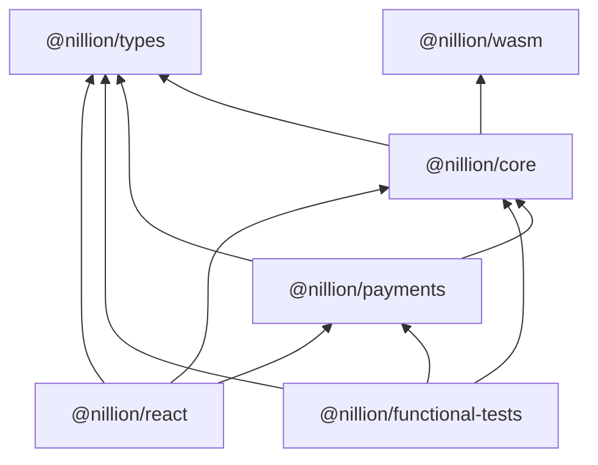

# nillion-ts

An exploration into how we can deliver a better DX to the TS/JS ecosystem.

## Notes

- built/tested with npm ... please use npm
-

@nillion/nilvm-wasm
@nillion/nilvm | core?
@nillion/types (fold types into core bc everythin deps on it?)
@nillion/payments why not nilchain?
@nillion/glue
@nillion/react
@nillion/tests
@nillion/examples

## dep graph

